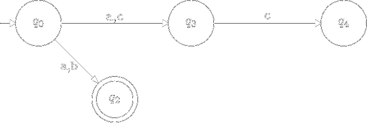



[Назад на головну](../README.md)

Зміст:

- [Мінімізація детермінованих скінчених автоматів](#мінімізація-детермінованих-скінчених-автоматів)
	- [Недосяжні стани](#недосяжні-стани)
	-
-
	-
	-
- [Контрольні запитання](#контрольні-запитання)

## Мінімізація детермінованих скінчених автоматів

В подальшому при програмуванні скінчених автоматів важливо мати справу
з так званими "мінімальними автоматами". _Мінімальним_ для даного скінченого
автомата називається еквівалентний йому автомат з мінімальною кількістю станів.

Нагадаємо, що два автомати називаються _еквівалентними_ якщо вони розпізнають одну мову.

Те, що скінчені автомати можна мінімізувати покажемо на наступному прикладі:

Навіть при поверхневому аналізі діаграми переходів наведеного скінченого
автомата видно, що вершини $$q_3$$, $$q_4$$ та $$q_5$$ є "зайвими", тобто при їх вилученні
новий автомат буде еквівалентний початковому. З наведеного вище прикладу
видно, що для отриманого детермінованого скінченого автомата можна
запропонувати еквівалентний йому автомат з меншою кількістю станів, тобто
мінімізувати скінчений автомат. Очевидно що серед зайвих станів цього
автомата є недосяжні та тупикові стани.

### Недосяжні стани

Стан $$q$$ скінченого автомата $$M$$ називається _недосяжним_, якщо на
діаграмі переходів скінченого автомата не існує шляху з $$q_0$$ в $$q$$.

**Алгоритм [пошуку недосяжних станів].** Спочатку спробуємо побудувати множину
досяжних станів. Якщо $$Q_m$$ &mdash; множина досяжних станів скінченого автомата $$M$$, то
$$Q \setminus Q_m$ &mdash; множина недосяжних станів. Побудуємо послідовність множин $$Q_0, Q_1, Q_2, \ldots$$ таким чином, що:

0. $$Q_0 = \{q_0\}$$.
1. $$Q_1 = Q_0 \cup \left\{ q \middle| q \in \delta (q_0, a), \forall a \in \Sigma \right\}$$.
2. $$Q_i = Q_{i-1} \cup \left\{ q \middle| q \in \delta(q_j, a), q_j \in Q_{i-1}, \forall a \in \Sigma \right\}$$.
3. $\ldots$
4. $$Q_m = Q_{m+1} = \ldots$$.

Справді, очевидно, що кількість кроків скінчена, тому що послідовність $$Q_i$$
монотонна ($$Q_0 \subseteq Q_1 \subseteq Q_2 \subseteq \ldots$$) 
та обмежена зверху: $$Q_m \subseteq |Q|$$.

Тоді $$Q_m$$ &mdash; множина досяжних станів скінченого автомата, 
а $$Q\setminus Q_m$$ &mdash; множина недосяжних станів.

Вилучимо з діаграми переходів скінченого автомата $$M$$ недосяжні вершини:

В новому автоматі функція $$\delta$$ визначається лише для досяжних
станів. Побудований нами скінчений автомат з меншою кількістю станів буде
еквівалентний початковому.

### 1.2

## 2

### 2.1

### 2.2

## Контрольні запитання

1. Які автомати називаються еквівалентними?
	<!--ті які задають одну мову-->
2. Який стан автомату називаєтсья недосяжним?
	<!--той у який немає шляху з $$q_0$$ на діаграмі переходів-->
3. Опишіть алгоритм пошуку недосяжних станів і доведіть його збіжність.
4.
	<!-- -->
5.
	<!-- -->
6.
	<!-- -->
7.
	<!-- -->
8.
	<!-- -->

(_традиційні_ відповіді можна переглянути у коментарях у вихідному коді цієї сторінки)

[Назад на головну](../README.md)