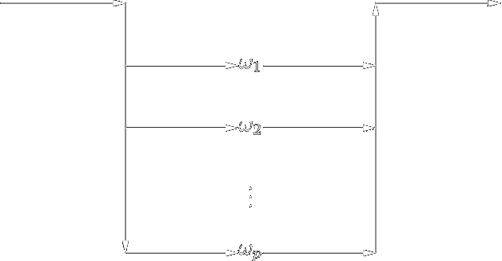



[Назад на головну](../README.md)

Зміст:

- [Синтаксична діаграма](#синтаксична-діаграма)

- [Контрольні запитання](#контрольні-запитання)

## Синтаксична діаграма

_Синтаксична діаграма_ &mdash; це орієнтований граф, дуги котрого позначені елементами 
$$(N \cup \Sigma)^\star$$. Синтаксична діаграма будується для кожного $$А$$-правила 
КС-граматики мови програмування.

Оскільки вершини такого графа не іменуються, то вони припускаються неявно. Синтаксична діаграма 
позначається іменем нетермінала, для якого вона будується.

Мета побудови синтаксичних діаграм для мови програмування на основі КС-граматики:

- для кожного $$А$$-правила КС-граматики будується синтаксична діаграма;

- на основі побудови синтаксичної діаграми для деякого нетермінала $$A \in N$$ будуємо 
	підпрограму, яка аналізує ту частину головної програми, яку вона визначає.

Оскільки у більшості випадків при визначенні синтаксису мови програмування ми користуємося 
множиною рекурсивних правил, то серед підпрограм, які будуються на основі правил граматики, 
будуть і рекурсивні процедури (рекурсія буде як явна, так і неявна).

Сформулюємо правила побудови синтаксичного графа:

1. Кожен нетермінал з відповідною множиною породжуючих правил 
	$$A \mapsto \omega_1 \mid \omega_2 \mid \ldots \mid \omega_p$$, 
	$$\omega_i \in (N \cup \Sigma)^\star$$, $$i = \overline{1..p}$$ відображається в один 
	синтаксичний граф.

	Отже, кількість синтаксичних графів рівна кількості нетерміналів граматики $$G$$.

2. Для кожного елемента ланцюжка $$\omega = \alpha_1 \alpha_2 \ldots \alpha_p$$, 
	$$\alpha_i \in (N \cup \Sigma)$$, $$i = \overline{1..p}$$ будуємо ребро синтаксичного графа 
	та покажемо його таким чином що:

	- якщо $$\alpha_i = x$$, $$x \in \Sigma$$, де $$x$$ &mdash; вихідна лексема, то будуємо 
		таке ребро:

		

	- якщо $$\alpha_k = A_i \in N$$ &mdash; нетермінал граматики, то будуємо таке ребро:

		

Тоді, коли правило граматики $$G$$ має вигляд $$A_i \mapsto \alpha_1 A_1 \ldots$$ для 
побудови діаграми скористаємося обома способами:


Коли правило граматики $$G$$ має вигляд 
$$A_i \mapsto \omega_1 \mid \omega_2 \mid \ldots \mid \omega_p$$, то відповідний 
синтаксичний граф буде мати вигляд:



де замість $$\omega_1, \omega_2, \ldots, \omega_p$$ будуються відповідні синтаксичні діаграми.

Якщо на основі граматики мови програмування побудована множина синтаксичних графів, то можна 
спробувати зменшити їх кількість, скориставшись підстановкою одних графів у інші. При цьому 
замість елемента $$A_i$$ підставляється його синтаксичний граф. Таким чином можна зменшити 
кількість синтаксичних графів. Для того, щоб забезпечити детермінований синтаксичний аналіз з
переглядом вперед на одну лексему, потрібно накласти певні обмеження, а саме: для кожного 
правила $$A_i$$ виду  $$A_i \mapsto \omega_1 \mid \omega_2 \mid \ldots \mid \omega_p$$ з 
синтаксичною діаграмою наведеного вище вигляду необхідне виконання наступної умови: множини 
$$\text{First}_1(\omega_j) \oplus_1 \text{Follow}_1 (A_i)$$, $$j = \overline{1..p}$$ 
повинні попарно не перетинатися. Зрозуміло, що ця умова гарантує детермінований вибір шляху 
при русі по синтаксичній діаграмі.

Подальше програмування синтаксичного аналізатора можна звести до наступних примітивів:

- для фрагмента синтаксичної діаграми вигляду 

	

	відповідний фрагмент програми (наприклад, мовою С) матиме вигляд:

	```c
	extern int lexem_code;  // код лексеми, яку виділив сканер
	extern char lexem_text[];  // текст лексеми
	...
	if (lexem_code == code_x) get_lexem();
	else error();
	```

- для фрагмента синтаксичної діаграми вигляду

	

	відповідний фрагмент програми матиме вигляд:

	```c
	// виклик функції, яка побудована для синтаксичної 
	// діаграми побудованої для нетермінала A_i.
	f_A_i();
	```

- для фрагмента синтаксичної діаграми вигляду

	

	відповідний фрагмент програми матиме вигляд:

	```c
	extern int lexem_code;
	extern char lexem_text[];
	...
	{
		if (lexem_code == code_alpha_1) get_lexem();
		else error();
		f_A_1();
		...
	}
	```

- для фрагмента синтаксичної діаграми вигляду

	

	для кожного $$\omega_i$$, $$i = \overline{1..p}$$ знайдемо множину $$\text{First}_1(\omega_i) \oplus_1 \text{Follow}_1(A) = L_i = \{a_i^1, a_i^2, \ldots, a_i^{n_i}\}$$.

	Оскільки за умовою $$L_i \cap L_j = \varnothing$$, $$i \ne j$$, то відповідний фрагмент 
	програми на мові С матиме вигляд:

	```c
	extern int lexem_code;
	extern char lexem_text[];
	...
	void f_A_i(void) {
		switch(lexema_code) {
			case code_a_1_1:
			case code_a_1_2:
			...
			case code_a_1_n_1:
				...  // фрагмент програми для w_1
				break;
			case code_a_2_1:
			case code_a_2_2:
			...
			case code_a_2_n_2:
				...  // фрагмент програми для w_2
				break;
			...
			...
			...
			case code_a_p_1:
			case code_a_p_2:
			...
			case code_a_p_n_p:
				...  // фрагмент програми для w_p
				break;
			default: 
				error();
		}
	}  // кінець функції для нетермінала A_i
	```

Відмітимо, що до того, як зменшувати кількість синтаксичних діаграм шляхом суперпозиції одних 
діаграм в інші, необхідно знайти контексти виду 
$$\text{First}_1(\omega_i) \oplus_1 \text{Follow}_1(A)$$ для тієї синтаксичної діаграми 
нетермінала $$A$$, для якої ми виконуємо операцію суперпозиції. Ці контексти ми використаємо 
при програмуванні синтаксичного аналізатора на основі синтаксичної діаграми, у яку підставлено 
синтаксичну діаграму для нетермінала $$A_i$$.

Досить часто при визначенні синтаксису мови програмування користуються
синтаксичними правилами виду 
$$A_i \mapsto \alpha_1 \alpha_2 \ldots \alpha_p A_i \mid \varepsilon$$. Тоді синтаксична 
діаграма буде мати вигляд:


Для вище наведеної синтаксичної діаграми відповідні множини будуть:
$$\text{First}_1(\alpha_1 \alpha_2 \ldots \alpha_p A_i) \oplus_1 \text{Follow}_1(A_i) = L_1 = \{a_1^1, a_1^2, \ldots, a_1^{n_1}\}$$. Відповідний фрагмент програми мовою С матиме вигляд:

```c
extern int lexem_code;
extern char lexem_text[];
void Ai(void) {
	while (
		lexem_code == code_a_1_1 ||
		lexem_code == code_a_1_2 ||
		... ||
		lexem_code == code_a_1_n_1
	) {
		...  // фрагмент програми для ланцюжка 
	}
}  // кінець підпрограми для нетермінала A_i
```

Виконавши аналіз варіантів побудови синтаксичного аналізатора на основі синтаксичних діаграм, покажемо вигляд основної &mdash; main-програми:

```c
int lexem_code;
char lexem_text[1<<8];
int main () { 
	get_lexem();
	axiom();  // процедура, пов'язана з аксіомою S граматики
}
```

## Контрольні запитання

1. 
	<!---->

2. 
	<!---->

3. 
	<!---->

4. 
	<!---->

5. 
	<!---->

6. 
	<!---->

(_традиційні_ відповіді можна переглянути у коментарях у вихідному коді цієї сторінки)

[Назад на головну](../README.md)